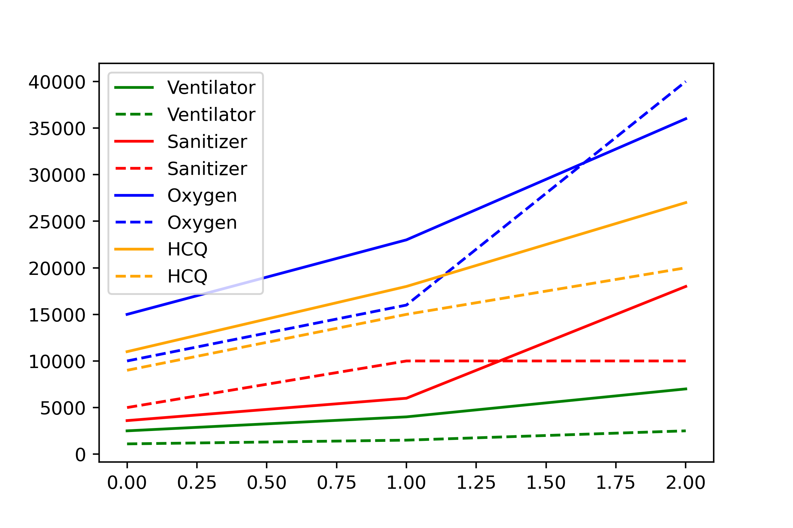
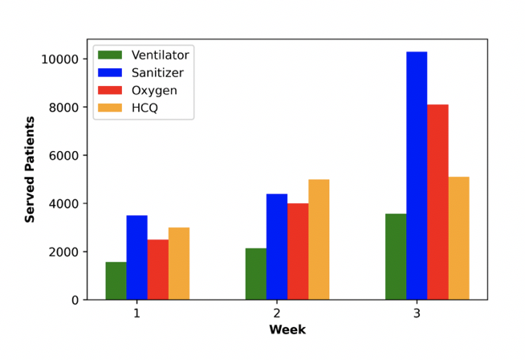
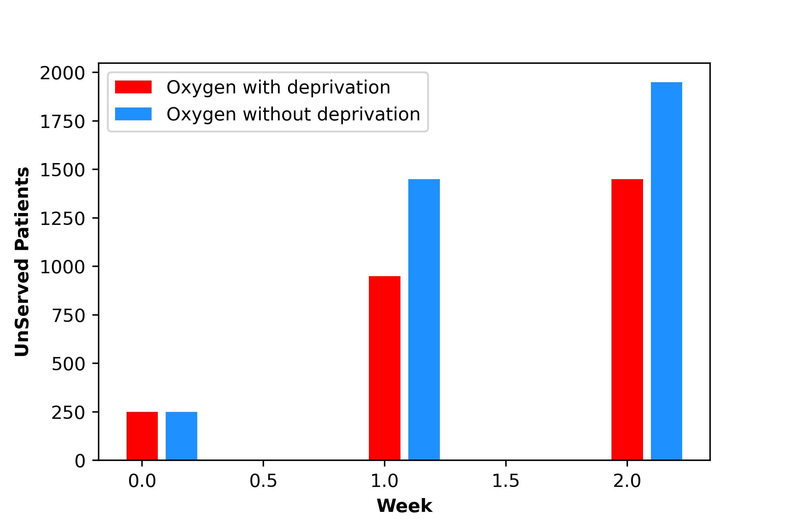
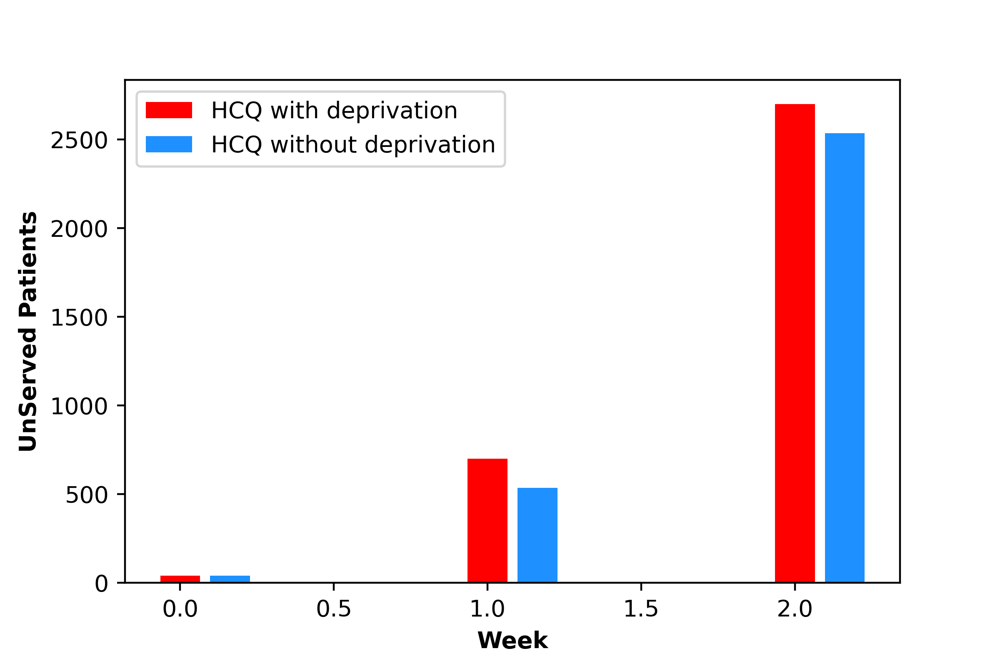

# Humanitarian Relief Transhipment Model

This is the implementation of Multi-Integer Programming of transhipment model for post-disaster humanitarian logistics using Gurobipy.  This model chooses the optimal way to distribute commodities by reducing the cost of inventory costs of multiple commodities and also take into account the cost of human suffering.

Demonstration of the model has been shown with Covid-19 data taken from https://covid19medinventory.in/. Thesis synopsis can be found at [Link](https://drive.google.com/file/d/1FYmH340ctkqFeRjGLbpP8KHIdJ0jUdGf/view?usp=sharing)

[Jupyter Notebook](https://nbviewer.jupyter.org/github/Kartikaggarwal98/Transhipment-Network/blob/master/mc_v_p_time_covid.ipynb)

[Python](https://github.com/Kartikaggarwal98/Transhipment-Network/tree/master/mc_v_p_time.py)

[Analysis on Covid-19](##Analysis)

## Stages

Stages of Transhipment models considering all factors one-at-time can be accessed as:
| URL | Info | 
|---|---|
| [Jupyter Notebook](https://nbviewer.jupyter.org/github/Kartikaggarwal98/Transhipment-Network/blob/master/notebooks/single_commodity.ipynb)  | Single commodity with multiple supply-demand nodes  |
| [Jupyter Notebook](https://nbviewer.jupyter.org/github/Kartikaggarwal98/Transhipment-Network/blob/master/notebooks/multi_commodity.ipynb)  | Multi-commodity with multiple supply-demand nodes  |
| [Jupyter Notebook](https://nbviewer.jupyter.org/github/Kartikaggarwal98/Transhipment-Network/blob/master/notebooks/mc_vehicle.ipynb)  | Multi-commodity with single vehicle for minimization of vehicle visits  |
| [Jupyter Notebook](https://nbviewer.jupyter.org/github/Kartikaggarwal98/Transhipment-Network/blob/master/notebooks/mc_v_cost.ipynb)  | Multi-commodity with single vehicle + minimization of net transport costs  by introducing individual supply-demand travel costs |
| [Jupyter Notebook](https://nbviewer.jupyter.org/github/Kartikaggarwal98/Transhipment-Network/blob/master/notebooks/mc_v_people.ipynb)  | Multi-commodity + Transport costs + Human Suffering at demand nodes to minimize unserved people  |
| [Jupyter Notebook](https://nbviewer.jupyter.org/github/Kartikaggarwal98/Transhipment-Network/blob/master/notebooks/mc_v_p_time.ipynb)  | Multi-commodity + Transport costs + Human Suffering at demand nodes to minimize unserved people taking care of deprivation costs |
| [Jupyter Notebook](https://nbviewer.jupyter.org/github/Kartikaggarwal98/Transhipment-Network/blob/master/notebooks/mc_mv_p_time.ipynb)  | Multi-commodity + Multi-vehicle Transport costs + Human Suffering at demand nodes to minimize unserved people taking care of deprivation costs |

## Analysis

Demand vs Supply (dotted) as function of time for each commodity

No of served patients (all commodities) for each week

Impact of the deprivation cost by comparison of 2 models:

